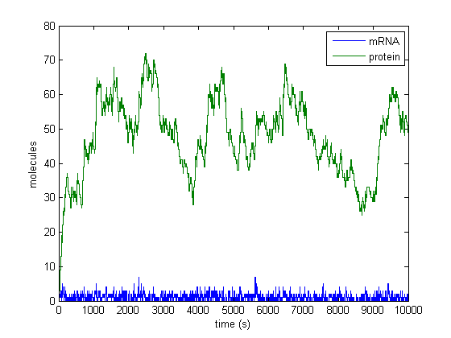

Gillespie
=========

Gillespie Stochastic Simulation Algorithm 

The two classic versions of the algorithm implemented in MATLAB:
- The _direct_ method
- The _first-reaction_ method

[Get it on the File Exchange!](http://www.mathworks.com/matlabcentral/fileexchange/34707-gillespie-stochastic-simulation-algorithm)

Example model
-------------


Consider the following two-state model of the expression of a single gene.
```
Reaction network:
    1. transcription:       0       --kR--> mRNA
    2. translation:         mRNA    --kP--> mRNA + protein
    3. mRNA decay:          mRNA    --gR--> 0
    4. protein decay:       protein --gP--> 0
```

1\. Provide the time interval and the initial state of the system. 

```matlab
tspan = [0, 10000]; %seconds
x0    = [0, 0];     %mRNA, protein
```

2\. Provide a stoichiometry matrix for your system. Each row of the stoichiometry matrix gives the stoichiometry of a reaction in the network.

```matlab
stoich_matrix = [ 1  0    %transcription
                  0  1    %translation
                 -1  0    %mRNA decay
                  0 -1 ]; %protein decay
```

3\. Provide a propensity function.

```matlab
pfun = @propensities_2state;
```

The solver calculates reaction propensities using a user-defined function. The inputs to this function are: 
- `x`: the state system at current time
- `p`: reaction rate constants

The order of the elements in the returned vector `a` should match the order of reactions in the stoichiometry matrix.

```matlab
function a = propensities_2state(x, p)
% Return reaction propensities given current state x
mRNA    = x(1);
protein = x(2);

a = [p.kR           %transcription
     p.kP*mRNA      %translation
     p.gR*mRNA      %mRNA decay
     p.gP*protein]; %protein decay
end
```

4\. Optionally, provide a set of rate constants to pass to the propensity function. Here, we define the rate constants as a struct:

```matlab
p.kR = 0.1;    %molecules/sec
p.kP = 0.1;    %sec^-1                    
p.gR = 0.1;    %sec^-1                         
p.gP = 0.002;  %sec^-1
```

5\. Run the solver!

```matlab
[t,x] = directMethod(stoich_matrix, pfun, tspan, x0, p);
```


